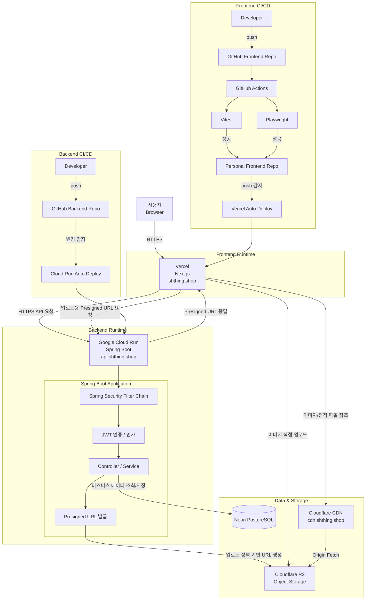

```mermaid
flowchart TB
    U[사용자<br/>Browser]

    subgraph FE_RUNTIME[Frontend Runtime]
        FE[Vercel<br/>Next.js<br/>shthing.shop]
    end

    subgraph BE_RUNTIME[Backend Runtime]
        CR[Google Cloud Run<br/>Spring Boot<br/>api.shthing.shop]

        subgraph APP[Spring Boot Application]
            SEC[Spring Security Filter Chain]
            JWT[JWT 인증 / 인가]
            CTRL[Controller / Service]
            SIGN[Presigned URL 발급]
        end
    end

    subgraph DATA[Data & Storage]
        DB[(Neon PostgreSQL)]
        R2[Cloudflare R2<br/>Object Storage]
        CDN[Cloudflare CDN<br/>cdn.shthing.shop]
    end

    subgraph FE_CICD[Frontend CI/CD]
        FED[Developer]
        FE_GH[GitHub Frontend Repo]
        GHA[GitHub Actions]
        VITEST[Vitest]
        PLAY[Playwright]
        PRIVATE[Personal Frontend Repo]
        VERCEL_DEPLOY[Vercel Auto Deploy]
    end

    subgraph BE_CICD[Backend CI/CD]
        BED[Developer]
        BE_GH[GitHub Backend Repo]
        CR_DEPLOY[Cloud Run Auto Deploy]
    end

    %% Runtime
    U -->|HTTPS| FE
    FE -->|HTTPS API 요청| CR
    CR --> SEC
    SEC --> JWT
    JWT --> CTRL
    CTRL -->|비즈니스 데이터 조회/저장| DB

    %% Upload flow
    FE -->|업로드용 Presigned URL 요청| CR
    CTRL --> SIGN
    SIGN -->|업로드 정책 기반 URL 생성| R2
    CR -->|Presigned URL 응답| FE
    FE -->|이미지 직접 업로드| R2

    %% Asset delivery
    FE -->|이미지/정적 파일 참조| CDN
    CDN -->|Origin Fetch| R2

    %% FE deploy
    FED -->|push| FE_GH
    FE_GH --> GHA
    GHA --> VITEST
    GHA --> PLAY
    VITEST -->|성공| PRIVATE
    PLAY -->|성공| PRIVATE
    PRIVATE -->|push 감지| VERCEL_DEPLOY
    VERCEL_DEPLOY --> FE

    %% BE deploy
    BED -->|push| BE_GH
    BE_GH -->|변경 감지| CR_DEPLOY
    CR_DEPLOY --> CR
```
